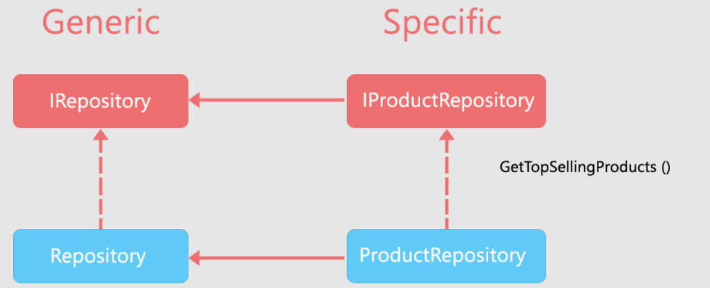

# Data Access Layer

Il Data Access Layer (DAL) la parte di un'applicazione web che si occupa di gestire l'accesso ai dati. Il suo compito principale è quello di fornire un'interfaccia tra il codice applicativo e il database, nascondendo la complessità di quest'ultimo e della comunicazione con lo stesso. Solitamente, il DAL fornisce una serie di metodi per creare, leggere, aggiornare e cancellare i dati. In questo modo, il resto del codice dell'applicazione non deve preoccuparsi dei dettagli tecnici del database.

## Il pattern Repository

I repository sono componenti che incapsulano la logica di accesso ai dati. Centralizzando tali funzionalità, è possibile raggiungere una manutenibilità maggiore del codice, insieme al disaccoppiamento dell'infrastruttura e/o della tecnologia usata per accedere al database (ORM) dal resto dell'applicazione.

La libreria CodeArchitects.Platform.Data definisce l'interfaccia generica `IRepository`, che modella il pattern appena descritto.

```c#
public interface IRepository<TEntity, TKey>
  where TEntity : class
  where TKey : IEquatable<TKey>
{
  Task<TEntity?> FindAsync(TKey key, CancellationToken cancellationToken = default);
  Task<TEntity?> FindAsync(TKey key, IncludeAction<TEntity> includeAction, CancellationToken cancellationToken = default);
  Task InsertAsync(TEntity entity, CancellationToken cancellationToken = default);
  Task UpdateAsync(TEntity entity, CancellationToken cancellationToken = default);
  Task UpsertAsync(TEntity entity, CancellationToken cancellationToken = default);
  Task RemoveAsync(TEntity entity, CancellationToken cancellationToken = default);
  Task RemoveAsync(TKey key, CancellationToken cancellationToken = default);
}
```

In cui `TEntity` rappresenta il tipo di entità che il repository gestisce e `TKey` il tipo della chiave primaria dell'entità.
Questa interfaccia definisce le operazioni di accesso ai dati più comuni; in particolare:

- `FindAsync` esegue una ricerca dell'entità per chiave primaria.
- `InsertAsync` inserisce nel database una nuova entità.
- `UpdateAsync` aggiorna i valori di un'entità esistente.
- `UpsertAsync` se l'entità già esiste nel database, aggiorna i suoi dati, altrimenti la inserisce.
- `RemoveAsync` rimuove un'entità dal database.

Sebbene questi siano le più comuni (CRUD), molto spesso è necessario eseguire delle operazioni specializzate (sia in lettura che scrittura) per un particolare tipo di entità. Per questo motivo, questa interfaccia è pensata per essere estesa da interfacce specializzate per singola entità che, oltre a tipizzare l'interfaccia base, definiscono metodi che rappresentano le suddette operazioni specializzate, in modo tale da centralizzarle e isolarle dal resto della logica applicativa, oltre a consolidarle semanticamente. Questo approccio prende il nome di pattern Repository generico.

Ad esempio, consideriamo un'entità chiamata `Product`, la cui chiave primaria è di tipo `Guid`.

```c#
public class Product
{
  public Guid Id { get; set; }
  public decimal Price { get; set; }
  public int SaleCount { get; set; }
}
```

Definiamo un'interfaccia specializzata per `Product` che estende la generica `IRepository<TEntity, TKey>` e che definisce un metodo per recuperare i prodotti più venduti.

```c#
using CodeArchitects.Platform.Data;

public interface IProductRepository : IRepository<Product, Guid>
{
  Task<IEnumerable<Product>> GetTopSellingProductsAsync(int count, CancellationToken cancellationToken = default);
}
```

Il metodo `GetTopSellingProducts` recupera gli N (parametro `count`) prodotti più venduti; altri metodi specializzati potranno essere definiti allo stesso modo e le parti dell'applicazione che utilizzano `IProductRepository` avranno accesso a questi metodi specializzati attraverso l'istanza del repository, oltre ai metodi definiti dall'interfaccia base generica.

## Implementazione del pattern Repository

Dall'interfaccia dei repository non si evince né il provider di database, né l'ORM utilizzato per accedervi, in quanto questi, essendo dettagli implementativi, saranno utilizzati dalle classi che forniranno l'implementazione dei metodi.

Al momento, sono disponibili due implementazioni del repository (e del resto del DAL):

- CodeArchitects.Platform.Data.EntityFrameworkCore: implementazione del DAL che utilizza Entity Framework Core 7.
- CodeArchitects.Platform.Data.AdoNet: implementazione del DAL che utilizza direttamente ADO.NET, da utilizzare tipicamente in congiunzione con Dapper.

> Nota: Entity Framework Core 7 richiede l'utilizzo di .NET 6 o superiore. Per progetti .NET Core 3.1 e .NET 5, esiste il pacchetto CodeArchitects.Platform.Data.EntityFrameworkCore che utilizza Entity Framework Core 5 ed è compatibile con .NET Core 3.1 e versioni superiori.

Queste due librerie forniscono l'implementazione di `IRepository<TEntity, TKey>` che potrà essere utilizzata come classe base per l'implementazione dei repository specializzati. Ad esempio, nel caso di `IProductRepository`, si ha il seguente schema:



Vediamo come implementare `IProductRepository` utilizzando Entity Framework Core, con `EFCoreRepository<TEntity, TKey>` come classe base.

```c#
using CodeArchitects.Platform.Data.EntityFrameworkCore;

public class ProductRepository : EFCoreRepository<Product, Guid>, IProductRepository
{
  public ProductRepository(IDataContext context)
    : base(context)
  {
  }

  public async Task<IEnumerable<Product>> GetTopSellingProductsAsync(int count, CancellationToken cancellationToken = default)
  {
    return await Entities
      .OrderBy(x => x.SaleCount)
      .Take(count)
      .ToListAsync(cancellationToken);
  }
}
```

La classe `EFCoreRepository` espone una proprietà protetta chiamata `Entities`, che corrisponde al `DbSet<TEntity>` (`DbSet<Product>` in questo caso). Attraverso il `DbSet` si potranno effettuare tutte le operazioni sull'entità `Product` che Entity Framework Core permette. Inoltre, `EFCoreRepository` espone anche l'istanza del `DbContext` utilizzato dall'applicazione tramite la proprietà protetta `DbContext`. Per ultimo, il costruttore richiede un'istanza dell'interfaccia `IDataContext` che, oltre a contenere il riferimento al `DbContext` dell'applicazione, fornisce l'implementazione dei metodi del repository generico, ma tipizzabili per qualsiasi tipo di entità (ad esempio `FindAsync<TEntity, TKey>`), in modo tale da poter aver accesso ai metodi base degli altri repository, senza dover iniettare il repository base; ciò può essere utile quando un repository espone i metodi di accesso ad un'intero aggregato, anziché ad una singola entità. Questo oggetto è disponibile tramite la proprietà protetta `Context` della classe base.

L'implementazione utilizzando ADO.NET (e Dapper) è strutturalmente molto simile, ma la query andrà scritta a mano o con qualche altro strumento di generazione di codice SQL (ad esempio SqlKata).

```c#
using CodeArchitects.Platform.Data.AdoNet;

public class ProductRepository : AdoNetRepository<Product, Guid>, IProductRepository
{
  public ProductRepository(IDataContext context)
    : base(context)
  {
  }

  public async Task<IEnumerable<Product>> GetTopSellingProductsAsync(int count, CancellationToken cancellationToken = default)
  {
    const string query = "SELECT [Id], [Price], [SaleCount] FROM [Products] ORDER BY [SaleCount] LIMIT @count";
    return await Connection.QueryAsync<Product>(query, new { count });
  }
}
```

In questo caso, la classe `AdoNetRepository` espone una proprietà protetta chiamata `Connection` (di tipo `IDbConnection`) con cui è possibile effettuare delle query. Anche in questo caso, si ha un'interfaccia `IDataContext` che, similmente all'implementazione con Entity Framework Core, espone i metodi CRUD generici e l'istanza della connessione.

## Il pattern Unit of Work

Il pattern Unit of Work è un pattern utilizzato per raggruppare delle modifiche effettuate al database in una singola operazione (l'unità di lavoro), ed è comunemente utilizzato in congiunzione con il pattern Repository.

La libreria CodeArchitects.Platform.Data definisce l'interfaccia `IUnitOfWork`:

```c#
public interface IUnitOfWork : IAsyncDisposable
{
  Task SaveAsync(CancellationToken cancellationToken = default);
}
```

L'unico metodo esposto da quest'interfaccia è il metodo `SaveAsync`, che serve a finalizare tutti i cambiamenti avvenuti all'interno dell'unità di lavoro.

Esistono due modi per creare un'unità di lavoro. Il primo è quello di creare puntualmente l'istanza di `IUnitOfWork` utilizzando l'interfaccia `IUnitOfWorkManager`:

```c#
public interface IUnitOfWorkManager
{
  IUnitOfWork Begin(CancellationToken cancellationToken = default);
  IUnitOfWork Begin(bool autoSave, CancellationToken cancellationToken = default);
}
```

Questa interfaccia definisce il metodo `Begin` che crea una nuova unità di lavoro; considerando che `IUnitOfWork` implementa `IAsyncDisposable`, questo metodo va utilizzato insieme al costrutto `await using`.

```c#
public class ShopService
{
  private readonly IUnitOfWorkManager _uowManager;
  private readonly IProductRepository _productRepo;
  private readonly ICartRepository _cartRepo;

  public MyService(IUnitOfWorkManager uowManager, IProductRepository productRepo, ICartRepository cartRepo)
  {
    _uowManager = uowManager;
    _productRepo = productRepo;
    _cartRepo = cartRepo;
  }

  public async Task FinalizeCartAsync(Cart cart, CancellationToken cancellationToken = default)
  {
    await using (IUnitOfWork uow = _uowManager.Begin(cancellationToken))
    {
      await _cartRepo.SetStatusToCompletedAsync(cart.Id, cancellationToken);
      foreach (Product product in cart.Products)
      {
        await _productRepo.IncrementSaleCountAsync(product.Id);
      }

      await uow.SaveAsync(cancellationToken);
    }
  }
}
```

In questo caso, all'interno dell'unità di lavoro (rappresentata dallo scope definito dal costrutto `await using`) avvengono operazioni su più entità (sul carrello e sui prodotti che esso contiene), che vengono eseguite tutte insieme nel momento in cui viene chiamato il metodo `SaveAsync`. In questo modo, tutte le operazioni vanno a compimento insieme oppure falliscono insieme, impedendo che il database si trovi in uno stato incoerente (ad esempio, carrello segnato come completato ma il numero di vendite dei prodotti che esso contiene non è stato incrementato).

Di default, è necessario chiamare il metodo `SaveAsync` quando si vuole effettuare il commit dei cambiamenti, ma esiste un'overload del metodo `Begin` che accetta un parametro `autoSave` di tipo `boolean` che, se impostato a `true`, effettua automaticamente l'invocazione a `SaveAsync` nel momento in cui lo scope definito dalla chiamata al metodo `Begin` termina.

```c#
await using (IUnitOfWork uow = _uowManager.Begin(autoSave: true, cancellationToken))
{
  await _cartRepo.SetStatusToCompletedAsync(cart.Id, cancellationToken);
  foreach (Product product in cart.Products)
  {
    await _productRepo.IncrementSaleCountAsync(product.Id);
  }
}
```

> Nota: è possibile invocare il metodo `SaveAsync` più volte all'interno dello stesso scope.

Il secondo modo per utilizzare l'interfaccia `IUnitOfWork` è quello di richiederne direttamente un'istanza tramite Dependency Injection. In questo caso, verrà creata una singola unità di lavoro per l'intero contesto di esecuzione (in altre parole, `IUnitOfWork` è registrato con `ServiceLifetime.Scoped`).

```c#
public class ShopService
{
  private readonly IUnitOfWork _uow;
  private readonly IProductRepository _productRepo;
  private readonly ICartRepository _cartRepo;

  public MyService(IUnitOfWork uow, IProductRepository productRepo, ICartRepository cartRepo)
  {
    _uow = uow;
    _productRepo = productRepo;
    _cartRepo = cartRepo;
  }

  public async Task FinalizeCartAsync(Cart cart, CancellationToken cancellationToken = default)
  {
    await _cartRepo.SetStatusToCompletedAsync(cart.Id, cancellationToken);
    foreach (Product product in cart.Products)
    {
      await _productRepo.IncrementSaleCountAsync(product.Id);
    }
    
    await _uow.SaveAsync(cancellationToken);
  }
}
```

## Seeding

Per effettuare il seeding del database è possibile estendere la classe base `DataSeed`:

```cs
public class ApplicationDataSeed : DataSeed
{
  public void Seed(ISeeder seeder)
  {
    seeder.Seed(
      new Product { ... },
      new Product { ... },
      new Product { ... },
      ...
    );
  }
}
```
