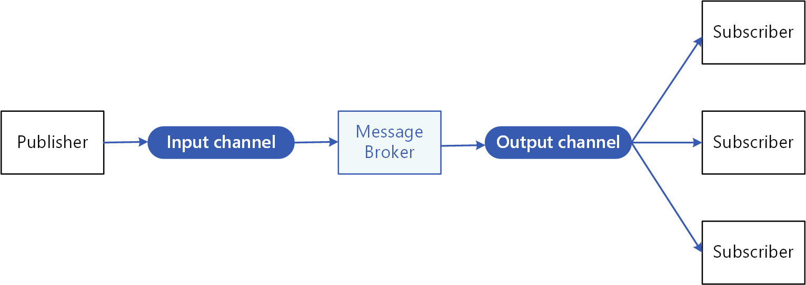

# Messaging

In cloud-based and distributed applications, components of the system often need to provide information to other components as events happen.

Asynchronous messaging is an effective way to decouple senders from consumers, and avoid blocking the sender to wait for a response.

The publish-subscribe pattern (or publisher/subscriber pattern, pub/sub for short) introduces an asyncronous messaging subsystem that includes the following:

- An input messaging channel used by the sender. The sender packages events into messages, using a known message format, and sends these messages via the input channel. The sender in this pattern is also called the publisher.
- One output messaging channel per consumer. The consumers are known as subscribers.
- A mechanism for copying each message from the input channel to the output channels for all subscribers interested in that message. This operation is typically handled by an intermediary such as a message broker or event bus.

The following diagram shows the logical components of this pattern:



For reference: <https://docs.microsoft.com/en-us/azure/architecture/patterns/publisher-subscriber>

There are other messaging patterns, such as asynchronous request/response, but pub/sub is the most used and other patterns can be implemented on top of that.

## Messages

Messages are packets of data which format is known by the publisher and by the subscriber. In the CA Framework, they are simple POCO's; they do not need to be marked with a marker interface. You typically want your messages to be light and simple because they will be serialized and sent over the network. As a consequence, they must expose properties with public getters and setters (or init-only setters). They do not contain behavior or logic.

This is an example of a message:

```c#
public class MyMessage
{
    public Guid Id { get; init; }
    public int SequenceNumber { get; init; }
    public string Content { get; init; }
}
```

If you are using C# 9, the new `record` type can be a good fit.

```c#
public record MyMessage(Guid Id, int SequenceNumber, string Content);
```

### Thinking in terms of commands and events

In DDD, there are two kind of messages: commands and events.

A command is a message that is sent to request an action to be performed. They should be named with a verb in an imperative mood plus the aggregate name which it operates on and, optionally, the 'Command' suffix: for instance, `SendEmailCommand`. Each command should be handled only once, so each command should have only one subscriber.

An event is a message that is sent to communicate about something that has happened, and typically has changed the state of the system. They should be named with the aggregate name where the event took place plus the verb in the past tense and, optionally, the 'Event' suffix: for instance, `EmailSentEvent`. Unlike commands, you can have multiple subscribers to the same event.

## Publishing

To publish a message, use the `IMessageBus` interface and its method `SendAsync`.

```c#
public class Publisher
{
    private readonly IMessageBus _bus;

    public async Task DoSomethingAndPublishAsync(string message)
    {
        // Some business logic
        MyMessage message = new MyMessage(Guid.NewGuid(), _sequenceNumber, message);
        await _bus.SendAsync(message);
        // Other business logic
    }
}
```

The `SendAsync` method accepts an optional `CancellationToken` that can be used to cancel the asynchronous publishing operation.

Sometimes, you will need to configure some options for sending messages. Normally, this is done in a dedicated configuration section or file, but in rare cases you will want to override that configuration for a particular message. In such occasions, the generic `IMessageBus<TMetadata>` interface comes handy. This interface extends the non-generic `IMessageBus` interface with an overload of the `SendAsync` method that also accepts an object of type `TMetadata` which contains metadata to provide to the bus for that particular message.

Metadata are specific to the bus implementation, so if you will ever need to switch between bus implementations, you will need to adjust your metadata accordingly.

## Subscribing

Subscribing to a message is done by implementing the `IMessageHandler<TMessage>` interface and its method `HandleAsync`.

```c#
public class MyMessageHandler : IMessageHandler<MyMessage>
{
    public async Task HandleAsync(MyMessage message, CancellationToken cancellationToken)
    {
        // Do something with the message
        // Forward the cancellationToken to your async methods in case the operation is cancelled by the caller
        Console.WriteLine($"Received a message with id {message.Id}!");
    }
}
```

Please note that metadata are information for the bus and are not passed to the handler.

## Implementations

The messaging interfaces are defined in the `CodeArchitects.Infrastructure` namespace, while their implementations can be found in more specific namespaces, i.e., `CodeArchitects.Infrastructure.Dapr`. Each implementation has its own feature and is configured differently, so be sure to read the documentation for your implementation of choice as well.

Available implementations are listed below:

- [Messaging with Dapr](messaging-dapr.md)
